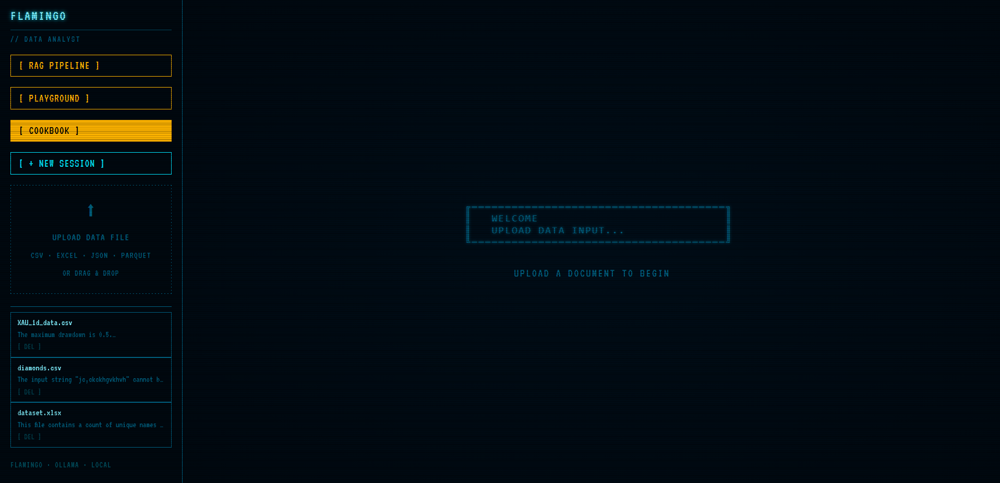
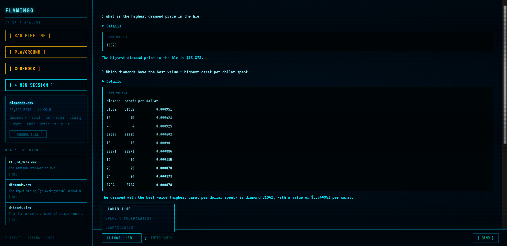
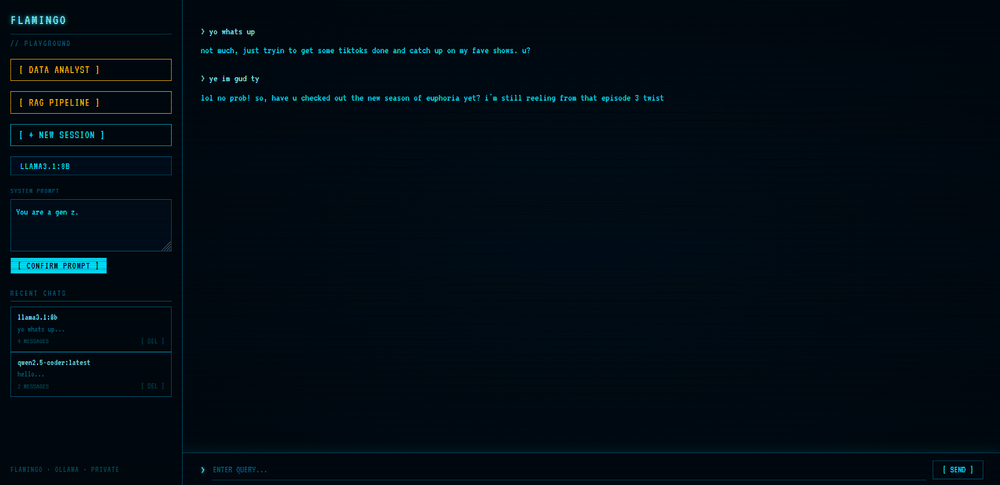
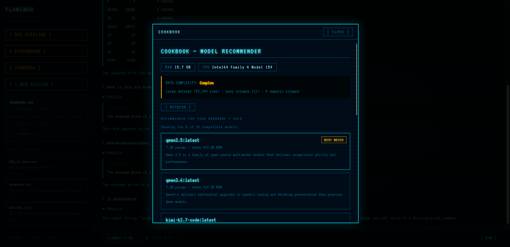

# Flamingo

A local, AI-powered data analysis tool and a workspace to test models that runs entirely on your machine(localhost), also got a cool retro-like UI.

Built on top of [Ollama](https://ollama.com) for local LLM inference.

---

## Screenshots






## What It Does

This project has three main features (most of it is vibecoded) :

### 1. Data Analyst
Upload any structured data file (CSV, Excel, JSON, Parquet) and ask questions about it. The AI writes Python/Pandas code behind the scenes, runs it on your data, and explains the result.

### 2. RAG Pipeline
Upload any document (PDF, TXT, DOCX, Markdown) and ask questions about its content. The system uses a semantic vector search and keyword search, then re-ranks results for accurate answers.

### 3. Playground
Choose your own model and enter the system prompt to test your models and have fun with it.

---

## Features

- **100% Local** — everything runs on your machine, no API keys needed
- **Any LLM** — switch between any model you have pulled in Ollama
- **Data Analyst** — ask complex analytical questions about CSV/Excel/JSON data
- **RAG Pipeline** — ask questions about PDF/DOCX/TXT documents with source citations
- **Chat History** — all conversations are saved and can be resumed anytime
- **Cookbook** — recommends the best LLM for your hardware and data complexity (inspired by pewdiepie, definitely did not steal)
- **Model Switcher** — change the active LLM mid-conversation from the UI
- **Stop Button** — interrupt a running query at any time
- **File Restore** — reopen old chats and continue where you left off

---

## Requirements

- Python 3.10 or higher
- [Ollama](https://ollama.com) installed and running
- At least one LLM pulled in Ollama
- 8GB+ RAM recommended (16GB for larger models, but still gonna be really slow)

---

## Setup

### 1. Clone the repository

```bash
git clone https://github.com/yourusername/AI-workspace.git
cd AI-workspace.git
```

### 2. Install Python dependencies

```bash
pip install -r requirements.txt
```

### 3. Install Ollama 

Download and install Ollama from [https://ollama.com](https://ollama.com)

### 4. Pull a model

```bash
#For Example: 
ollama pull qwen2.5-coder:7b

ollama pull llama3.1:8b

ollama pull phi3:mini
```

### 5. Start the app

```bash
cd source
python app.py
```

### 6. Open in browser

```
http://localhost:5000
```

---

## License

MIT License — free to use, modify, and distribute.